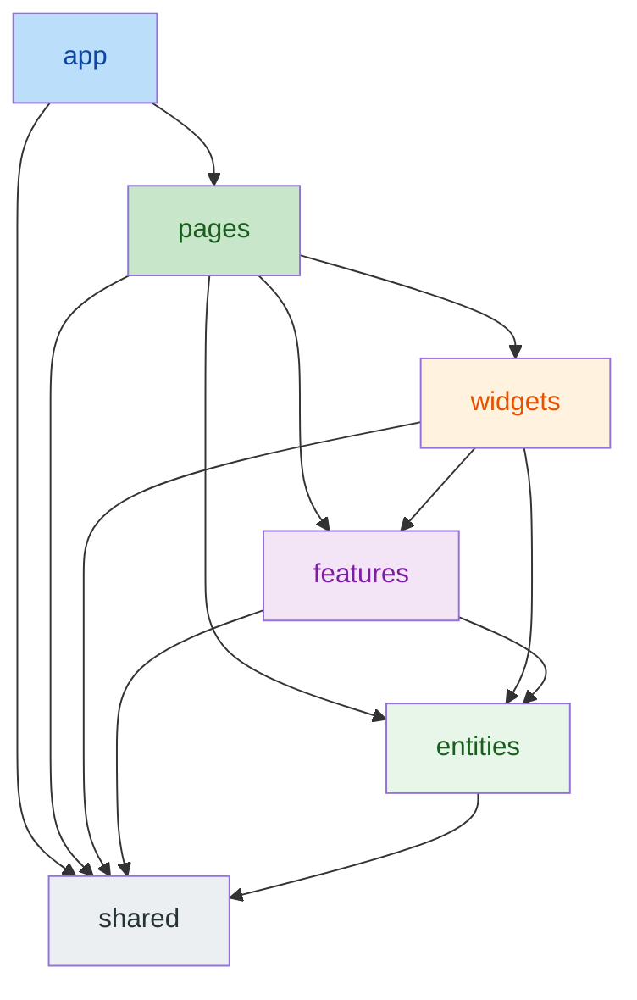
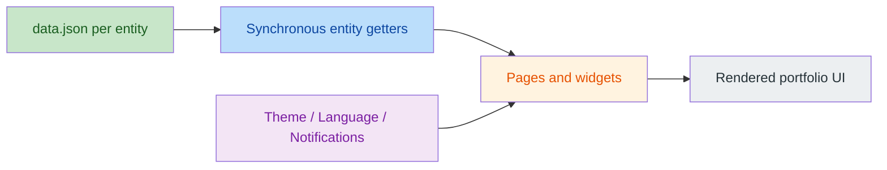

# 🏗️ Architecture Guide

🇺🇸 **English** | [🇪🇸 Español](docs/es/ARCHITECTURE.md)

This document provides a detailed analysis of the architectural patterns and technology decisions for the Portfolio project. For deployment, infrastructure, and environment configuration, see the [Operations Guide](OPERATIONS.md).

---

## 🏗️ Architecture & Principles

The project is a **fully static frontend application**. There is no backend, no database, and no server runtime — only static assets served by a CDN.

### ⚛️ Frontend Architecture
- **Feature-Sliced Design (FSD):** Codebase organized into 6 canonical layers — `app/`, `pages/`, `widgets/`, `features/`, `entities/`, `shared/` — with strict import rules enforced by `eslint-plugin-fsd-lint`.
- **Static Content Model:** All business content (profile, projects, skills, experiences, spoken languages) lives in bilingual JSON files inside each entity's `api/` segment (`frontend/src/entities/<entity>/api/data.json`). Content is read synchronously at runtime and is validated by the test suite.
- **State Management:** React Context API for cross-cutting concerns like Theme, Language, and Notifications. No server state exists.
- **Dynamic Localization:** Centralized i18next system for real-time interface translation; content fields are bilingual En/Es pairs in the JSON data.

### 🖼️ Asset Strategy
- All images are **self-hosted** under `frontend/public/images/` (one folder per project slug, profile photo, and a local "no image" fallback).
- External image hosts are forbidden by convention and enforced by data-integrity tests.

### 📬 Contact
- The contact form runs entirely in the browser via **EmailJS**; there is no server-side mail handling.

## 📊 Architecture at a Glance

### FSD layer flow

### Static content flow

### Agent-readable output

The same entity data feeds a build-time generator (`tooling/agent-files/`, wired into `vite.config.ts`) that emits, with nothing generated committed to git:

- `llms.txt`, `robots.txt` and `sitemap.xml` at the site root.
- Markdown twins (`/about/index.md`, `/about/index.es.md`, ...) in English and Spanish for every route, linked from the HTML with `<link rel="alternate" type="text/markdown">`.
- One HTML shell per route with its own title, description, canonical address and markdown alternates, so agents and crawlers that do not run JavaScript read the same content as the SPA.

`pnpm dev` serves the generated files through middleware; `pnpm build` emits them into `dist/`. Unit tests pin content, metadata parity with i18n and that every internal link resolves to a generated file.

---

## 📐 Content Model

The content schema mirrors the previous API contract (bilingual fields, ordered collections):

| Entity | JSON location | Key fields |
|---|---|---|
| Profile | `entities/profile/api/data.json` | greeting, title, subtitle, description, about*, sentence, fullName, location, email, githubUrl, linkedinUrl, cvUrl, logoText, imageUrl (En/Es pairs) |
| Project | `entities/project/api/data.json` | id, title, description, technologies, imageUrls, imageUrlsFull, githubUrl, liveUrl, type, featured, order |
| Skill | `entities/skill/api/data.json` | name, level (0-100), category, order |
| Experience | `entities/experience/api/data.json` | company, position, dates, description, technologies |
| SpokenLanguage | `entities/spoken-language/api/data.json` | name, level, proficiency, order (En/Es pairs) |

**Integrity rules** (enforced by `data.test.ts` per entity):
- Every referenced image must exist in `public/images/` and be a local path.
- Collections must be ordered (projects/skills/languages by `order` asc; experiences by `endDate DESC NULLS FIRST, startDate DESC` — same ordering the API used to provide).
- Field contract must hold (types, non-empty bilingual texts, valid ranges).

---

## 🚫 Legal Notice

**© 2026 Gonzalo Martínez García. All rights reserved.**

This software is **proprietary** and is provided for **evaluation purposes only**.
- **Unauthorized copying**, modification, distribution, or use of this software, via any medium, is strictly prohibited.
- **Personal use for other portfolios is not allowed.**
- See the [LICENSE](LICENSE) file for full terms and conditions.

---

**Developed by Gonzalo Martínez García**
*Full Stack Developer | Software Engineering & Innovation*
