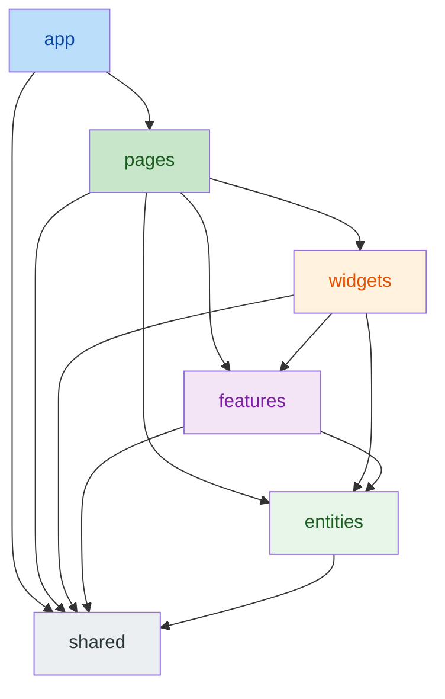
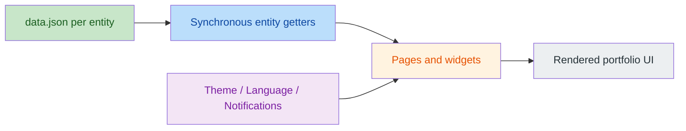

# 🏗️ Architecture Guide

🇺🇸 **English** | [🇪🇸 Español](docs/es/ARCHITECTURE.md)

This document provides a detailed analysis of the architectural patterns and technology decisions for the Portfolio project. For deployment, infrastructure, and environment configuration, see the [Operations Guide](OPERATIONS.md).

---

## 🏗️ Architecture & Principles

The project is a **fully static frontend application**. There is no backend, no database, and no server runtime — only static assets served by a CDN.

### ⚛️ Frontend Architecture
- **Feature-Sliced Design (FSD):** Codebase organized into 6 canonical layers — `app/`, `pages/`, `widgets/`, `features/`, `entities/`, `shared/` — with strict import rules enforced by `eslint-plugin-fsd-lint`.
- **Static Content Model:** All business content (profile, projects, skills, experiences, spoken languages) lives in bilingual JSON files inside each entity's `api/` segment (`frontend/src/entities/<entity>/api/data.json`). Content is read synchronously at runtime and is validated by the test suite.
- **State Management:** React Context API for cross-cutting UI state: theme, language and notifications. No server state exists. The theme follows the operating system until the visitor picks one; only explicit choices are saved, through a storage helper that keeps the page working when the browser blocks site data.
- **Dynamic Localization:** Centralized i18next system for real-time interface translation; content fields are bilingual En/Es pairs in the JSON data. The language comes from a `?lang=es|en` link, then the visitor's saved choice, then the browser; the URLs and their SEO metadata stay English (no `/es/` routes), so search engines index the English version only. Dates and percentages are formatted per language by the same helpers in the pages and the markdown twins (`Mar 2025 – Jun 2025`, `mar 2025 – jun 2025`, `80 %` in Spanish).
- **Single route list:** `APP_ROUTES` (`frontend/src/shared/config/routes.ts`) feeds the router, both navigation menus and the build-time HTML shells, so a page cannot exist without its shell. Any other address is a real 404 (see below).

### 🖼️ Asset Strategy
- Content images are **self-hosted** under `frontend/public/images/`: one folder per project slug, the profile photo in `profile/` and the generic `no-image.svg` fallback. The profile fallback (`profile-fallback.webp`) and the social preview (`og-cover-typographic.jpg`) sit at `frontend/public/`, and the GONZALO.DEV icons (SVG, ICO and apple-touch PNG) in `frontend/public/icons/`.
- Every project image ships in three WebP widths (`-thumb` 160 px, `-800`, `-full`) and records its full width and English/Spanish alt texts in the data. Covers are composed at exactly 16:9, the ratio the cards reserve, so they are never cropped and nothing shifts while they load.
- The Inter font is bundled (`@fontsource-variable/inter`) and its latin file is preloaded by the build.
- External image and font hosts are forbidden: the data-integrity tests reject external image URLs and the Content-Security-Policy would block them.

### 📬 Contact
- The contact form runs entirely in the browser via **EmailJS**; there is no server-side mail handling. The SDK is loaded only when a message is sent, fields are validated in the visitor's language, and after 15 seconds without an answer the visitor is asked to email instead of resending (the message may still arrive).

### 🔒 Security
- There is no backend and no authentication surface. Vercel sends a strict Content-Security-Policy on every response (scripts only from the site plus the inline theme script by its hash, network requests only to EmailJS) and the usual hardening headers; see the [Operations Guide](OPERATIONS.md).

## 📊 Architecture at a Glance

### FSD layer flow

### Static content flow

### Agent-readable output

The same entity data feeds a build-time generator (`frontend/tooling/agent-files/`, wired into `frontend/vite.config.ts`) that emits, with nothing generated committed to git:

- `llms.txt`, `robots.txt` and `sitemap.xml` at the site root.
- Markdown twins (`/about/index.md`, `/about/index.es.md`, ...) in English and Spanish for every route, linked from the HTML with `<link rel="alternate" type="text/markdown" hreflang="en|es">`. Each twin ends with links to the other pages, and they are served with `X-Robots-Tag: noindex`, so search engines index the HTML pages instead.
- One HTML shell per route, the home page included, with its own title, description, Open Graph title/description/URL, canonical address, markdown alternates and structured data: one JSON-LD `@graph` with `WebSite` and `Person` (name, job title, core competencies, spoken languages and profiles, all derived from the content). Crawlers and link previews get the right metadata without running JavaScript; the page content itself reaches readers without JavaScript through the markdown twins, which the shell's `<noscript>` text links. After a client-side navigation the SPA points the canonical link and the alternates at the new page.
- `404.html` (`noindex`, no canonical), which Vercel serves with status 404 for any other address; with JavaScript, the app on that page sends the visitor home.

`pnpm dev` serves `llms.txt`, `robots.txt`, `sitemap.xml` and the markdown twins through middleware; the per-route HTML shells, their head block (canonical, alternates, JSON-LD) and `404.html` are only produced by `pnpm build` (check them with `pnpm preview` at the trailing-slash address, e.g. `/about/`). `pnpm build` emits everything into `dist/`. Unit tests pin content, metadata parity with i18n and that every internal link resolves to a generated file.

---

## 📐 Content Model

Every record has an `id` (projects use it as their slug and image folder). † marks an En/Es pair (`titleEn`/`titleEs`); the other fields hold one value for both languages.

| Entity | JSON location (under `frontend/src/`) | Key fields |
|---|---|---|
| Profile | `entities/profile/api/data.json` | greeting†, subtitle†, description†, about*† (title, intro title, summary, philosophy), sentence†, fullName†, location†; alternateName (full legal name, JSON-LD only), email, githubUrl, linkedinUrl, cvUrl, logoText, imageUrl |
| Project | `entities/project/api/data.json` | title†, description†, technologies (names, shown untranslated), images (ordered `base`, `fullWidth`, `altEn`/`altEs`; the first is the cover), links (ordered `kind` + `url`; kinds registered in `entities/project/model/projectLinks.ts`), type (`WEB`/`DESKTOP`/`MOBILE`/`OTHER`), featured, order |
| Skill | `entities/skill/api/data.json` | name†, level (0-100), category (one of `SKILL_CATEGORY_ORDER`, translated through i18n), order |
| Experience | `entities/experience/api/data.json` | company†, position†, startDate, endDate (omitted for the current role), description†, technologies |
| SpokenLanguage | `entities/spoken-language/api/data.json` | name†, level†, order |

**Integrity rules** (enforced by `data.test.ts` per entity):
- Every referenced image must be a local path that exists under `frontend/public/images/`. Each project image ships its `-thumb`, `-800` and `-full` variants at the widths `fullWidth` implies (never upscaled), every cover is exactly 16:9, every image has alt texts in both languages (different, at most 250 characters), and no project image ships unused.
- Project links use a registered kind and an `https` address, with no address repeated within a project.
- Technologies are listed once per project or experience; skill categories come from `SKILL_CATEGORY_ORDER`.
- Collections must be ordered (projects/skills/languages by `order` asc; experiences by `endDate DESC NULLS FIRST, startDate DESC`).
- Field contract must hold (types, non-empty text on both sides of every En/Es pair, valid ranges, `YYYY-MM-DD` dates, `https` profile links).

---

## 🚫 Legal Notice

**© 2026 Gonzalo Martínez García. All rights reserved.**

This software is **proprietary** and is provided for **evaluation purposes only**.
- **Unauthorized copying**, modification, distribution, or use of this software, via any medium, is strictly prohibited.
- **Personal use for other portfolios is not allowed.**
- See the [LICENSE](LICENSE) file for full terms and conditions.

---

**Developed by Gonzalo Martínez García**
*Junior Full Stack Developer | Software Engineering & Innovation*
