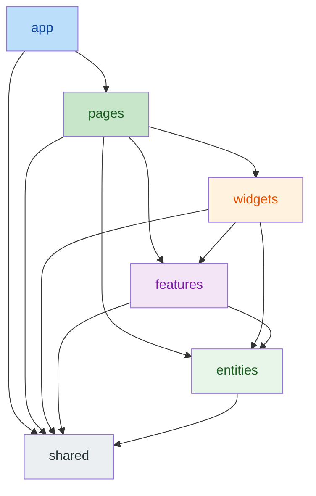
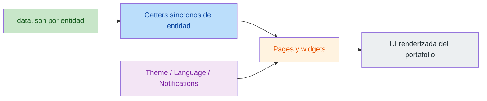

# 🏗️ Guía de arquitectura

🇺🇸 [English](../../ARCHITECTURE.md) | **🇪🇸 Español**

Este documento ofrece un análisis detallado de los patrones arquitectónicos y las decisiones tecnológicas del proyecto Portafolio. Para despliegue, infraestructura y configuración de entorno, consulta la [Guía de operaciones](OPERATIONS.md).

---

## 🏗️ Arquitectura y principios

El proyecto es una **aplicación frontend totalmente estática**. No hay backend, no hay base de datos y no hay runtime de servidor: solo assets estáticos servidos por una CDN.

### ⚛️ Arquitectura del frontend
- **Feature-Sliced Design (FSD):** código organizado en 6 capas canónicas — `app/`, `pages/`, `widgets/`, `features/`, `entities/`, `shared/` — con reglas de importación estrictas aplicadas por `eslint-plugin-fsd-lint`.
- **Modelo de contenido estático:** todo el contenido de negocio (perfil, proyectos, habilidades, experiencias, idiomas hablados) vive en JSON bilingües dentro del segmento `api/` de cada entidad (`frontend/src/entities/<entidad>/api/data.json`). El contenido se lee de forma síncrona en runtime y lo valida la suite de tests.
- **Gestión de estado:** React Context API para el estado de interfaz transversal: tema, idioma y notificaciones. No existe estado de servidor. El tema sigue al sistema operativo hasta que el visitante elige uno; solo se guardan las elecciones explícitas, mediante un helper de almacenamiento que mantiene la página en marcha cuando el navegador bloquea los datos del sitio.
- **Localización dinámica:** sistema centralizado i18next para traducción de la interfaz en tiempo real; los campos de contenido son pares bilingües En/Es en los JSON de datos. El idioma sale de un enlace `?lang=es|en`, después de la elección guardada del visitante y, si no hay, del navegador; las URLs y sus metadatos SEO siguen en inglés (sin rutas `/es/`), así que los buscadores solo indexan la versión en inglés. Las fechas y los porcentajes se formatean según el idioma con los mismos helpers en las páginas y en las copias markdown (`Mar 2025 – Jun 2025`, `mar 2025 – jun 2025`, `80 %` en español).
- **Lista única de rutas:** `APP_ROUTES` (`frontend/src/shared/config/routes.ts`) alimenta el router, los dos menús de navegación y los shells HTML que se generan en build, así que no puede existir una página sin su shell. Cualquier otra dirección es un 404 real (ver más abajo).

### 🖼️ Estrategia de assets
- Las imágenes de contenido están **autohospedadas** en `frontend/public/images/`: una carpeta por slug de proyecto, la foto de perfil en `profile/` y el fallback genérico `no-image.svg`. El fallback del perfil (`profile-fallback.webp`) y la vista previa social (`og-cover-typographic.jpg`) están en `frontend/public/`, y los iconos GONZALO.DEV (SVG, ICO y PNG apple-touch) en `frontend/public/icons/`.
- Cada imagen de proyecto se publica en tres anchos WebP (`-thumb` de 160 px, `-800` y `-full`) y guarda en los datos su ancho completo y sus textos alternativos en inglés y en español. Las portadas se componen exactamente en 16:9, la proporción que reservan las tarjetas, así que nunca se recortan y nada se desplaza mientras cargan.
- La fuente Inter va en el bundle (`@fontsource-variable/inter`) y el build precarga su fichero latino.
- Los hosts externos de imágenes y fuentes están prohibidos: los tests de integridad de datos rechazan las URLs de imágenes externas y la Content-Security-Policy las bloquearía.

### 📬 Contacto
- El formulario de contacto funciona íntegramente en el navegador mediante **EmailJS**; no hay gestión de correo en servidor. El SDK solo se carga al enviar un mensaje, los campos se validan en el idioma del visitante y, si no hay respuesta en 15 segundos, se le pide que escriba por correo en lugar de reenviar (puede que el mensaje llegue igualmente).

### 🔒 Seguridad
- No hay backend ni superficie de autenticación. Vercel envía en cada respuesta una Content-Security-Policy estricta (scripts solo del propio sitio más el script de tema en línea por su hash, peticiones de red solo a EmailJS) y las cabeceras de endurecimiento habituales; ver la [Guía de operaciones](OPERATIONS.md).

## 📊 Arquitectura de un vistazo

### Flujo de capas FSD

### Flujo de contenido estático

### Salida para agentes

El mismo contenido de las entidades alimenta un generador en build (`frontend/tooling/agent-files/`, integrado en `frontend/vite.config.ts`) que emite, sin nada generado en git:

- `llms.txt`, `robots.txt` y `sitemap.xml` en la raíz del sitio.
- Copias markdown (`/about/index.md`, `/about/index.es.md`, ...) en inglés y español para cada ruta, enlazadas desde el HTML con `<link rel="alternate" type="text/markdown" hreflang="en|es">`. Cada copia termina con enlaces al resto de páginas y se sirven con `X-Robots-Tag: noindex`, para que los buscadores indexen las páginas HTML.
- Un shell HTML por ruta, incluida la de inicio, con su propio title, description, título/descripción/URL de Open Graph, canonical, alternates markdown y datos estructurados: un `@graph` JSON-LD con `WebSite` y `Person` (nombre, puesto, competencias principales, idiomas y perfiles, todo derivado del contenido). Los crawlers y las vistas previas de enlaces reciben los metadatos correctos sin ejecutar JavaScript; el contenido de la página llega a quien no ejecuta JavaScript a través de las copias markdown, que enlaza el texto `<noscript>` del shell. Tras una navegación en el cliente, la SPA apunta el canonical y los alternates a la página nueva.
- `404.html` (`noindex`, sin canonical), que Vercel sirve con estado 404 para cualquier otra dirección; con JavaScript, la app de esa página lleva al visitante al inicio.

`pnpm dev` sirve `llms.txt`, `robots.txt`, `sitemap.xml` y las copias markdown por middleware; los shells HTML por ruta, su bloque de cabecera (canonical, alternates, JSON-LD) y `404.html` solo los genera `pnpm build` (compruébalos con `pnpm preview` en la dirección con barra final, p. ej. `/about/`). `pnpm build` lo emite todo en `dist/`. Los tests fijan el contenido, la paridad de metadatos con i18n y que todo enlace interno resuelva a un fichero generado.

---

## 📐 Modelo de contenido

Todo registro tiene un `id` (los proyectos lo usan como slug y carpeta de imágenes). † marca un par En/Es (`titleEn`/`titleEs`); el resto de campos guarda un único valor para los dos idiomas.

| Entidad | Ubicación JSON (bajo `frontend/src/`) | Campos clave |
|---|---|---|
| Perfil | `entities/profile/api/data.json` | greeting†, subtitle†, description†, about*† (título, título de introducción, resumen, filosofía), sentence†, fullName†, location†; alternateName (nombre legal completo, solo JSON-LD), email, githubUrl, linkedinUrl, cvUrl, logoText, imageUrl |
| Proyecto | `entities/project/api/data.json` | title†, description†, technologies (nombres, sin traducir), images (en orden: `base`, `fullWidth`, `altEn`/`altEs`; la primera es la portada), links (en orden: `kind` + `url`; tipos registrados en `entities/project/model/projectLinks.ts`), type (`WEB`/`DESKTOP`/`MOBILE`/`OTHER`), featured, order |
| Habilidad | `entities/skill/api/data.json` | name†, level (0-100), category (una de `SKILL_CATEGORY_ORDER`, traducida con i18n), order |
| Experiencia | `entities/experience/api/data.json` | company†, position†, startDate, endDate (se omite en el puesto actual), description†, technologies |
| Idioma | `entities/spoken-language/api/data.json` | name†, level†, order |

**Reglas de integridad** (aplicadas por `data.test.ts` de cada entidad):
- Toda imagen referenciada debe ser una ruta local que exista en `frontend/public/images/`. Cada imagen de proyecto incluye sus variantes `-thumb`, `-800` y `-full` con los anchos que se deducen de `fullWidth` (nunca ampliadas), toda portada mide exactamente 16:9, cada imagen tiene textos alternativos en los dos idiomas (distintos, de 250 caracteres como máximo) y no se publica ninguna imagen de proyecto sin usar.
- Los enlaces de proyecto usan un tipo registrado y una dirección `https`, sin repetir direcciones dentro de un proyecto.
- Cada tecnología aparece una sola vez por proyecto o experiencia; las categorías de habilidad salen de `SKILL_CATEGORY_ORDER`.
- Las colecciones deben estar ordenadas (proyectos/habilidades/idiomas por `order` asc; experiencias por `endDate DESC NULLS FIRST, startDate DESC`).
- El contrato de campos debe cumplirse (tipos, texto no vacío en los dos lados de cada par En/Es, rangos válidos, fechas `YYYY-MM-DD`, enlaces de perfil `https`).

---

## 🚫 Aviso legal

**© 2026 Gonzalo Martínez García. Todos los derechos reservados.**

Este software es **propietario** y se proporciona **únicamente con fines de evaluación**.
- **Queda estrictamente prohibida la copia**, modificación, distribución o uso no autorizado de este software por cualquier medio.
- **No está permitido el uso personal para otros portafolios.**
- Consulta el archivo [LICENSE](../../LICENSE) para los términos y condiciones completos.

---

**Desarrollado por Gonzalo Martínez García**
*Desarrollador Full Stack junior | Ingeniería de software e innovación*
