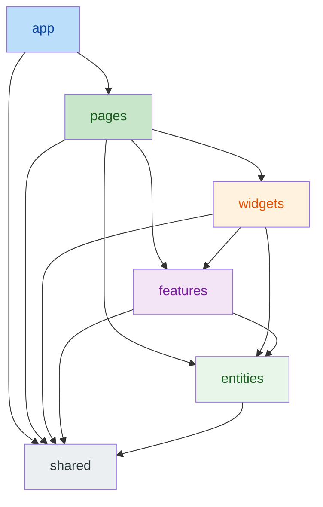
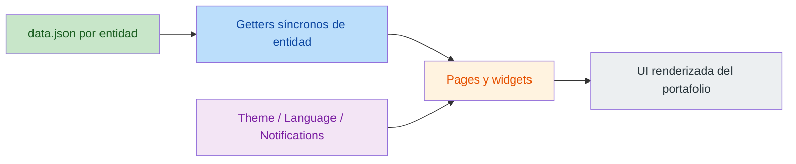

# 🏗️ Guía de Arquitectura

🇺🇸 [English](../ARCHITECTURE.md) | **🇪🇸 Español**

Este documento ofrece un análisis detallado de los patrones arquitectónicos y las decisiones tecnológicas del proyecto Portafolio. Para despliegue, infraestructura y configuración de entorno, consulta la [Guía de Operaciones](OPERATIONS.md).

---

## 🏗️ Arquitectura y Principios

El proyecto es una **aplicación frontend totalmente estática**. No hay backend, no hay base de datos y no hay runtime de servidor: solo assets estáticos servidos por una CDN.

### ⚛️ Arquitectura del Frontend
- **Feature-Sliced Design (FSD):** código organizado en 6 capas canónicas — `app/`, `pages/`, `widgets/`, `features/`, `entities/`, `shared/` — con reglas de importación estrictas aplicadas por `eslint-plugin-fsd-lint`.
- **Modelo de Contenido Estático:** todo el contenido de negocio (perfil, proyectos, habilidades, experiencias, idiomas hablados) vive en JSON bilingües dentro del segmento `api/` de cada entidad (`frontend/src/entities/<entidad>/api/data.json`). El contenido se lee de forma síncrona en runtime y se valida en tiempo de build/test.
- **Gestión de Estado:** React Context API para preocupaciones transversales como Tema, Idioma y Notificaciones. No existe estado de servidor.
- **Localización Dinámica:** sistema centralizado i18next para traducción de la interfaz en tiempo real; los campos de contenido son pares bilingües En/Es en los JSON de datos.

### 🖼️ Estrategia de Assets
- Todas las imágenes están **autohospedadas** en `frontend/public/images/` (una carpeta por slug de proyecto, foto de perfil y un fallback local "sin imagen").
- Los hosts de imágenes externos están prohibidos por convención y se aplican mediante tests de integridad de datos.

### 📬 Contacto
- El formulario de contacto funciona íntegramente en el navegador mediante **EmailJS**; no hay gestión de correo en servidor.

## 📊 Arquitectura de un Vistazo

### Flujo de capas FSD

### Flujo de contenido estático

---

## 📐 Modelo de Contenido

El esquema de contenido refleja el contrato de la API anterior (campos bilingües, colecciones ordenadas):

| Entidad | Ubicación JSON | Campos clave |
|---|---|---|
| Perfil | `entities/profile/api/data.json` | greeting, title, subtitle, description, about*, cvUrl, redes, imageUrl (pares En/Es) |
| Proyecto | `entities/project/api/data.json` | title, description, technologies, imageUrls, githubUrl, liveUrl, type, featured, order |
| Habilidad | `entities/skill/api/data.json` | name, level (0-100), category, order |
| Experiencia | `entities/experience/api/data.json` | company, position, fechas, description, technologies |
| Idioma | `entities/spoken-language/api/data.json` | name, level, proficiency, order |

**Reglas de integridad** (aplicadas por `data.test.ts` de cada entidad):
- Toda imagen referenciada debe existir en `public/images/` y ser una ruta local.
- Las colecciones deben estar ordenadas (proyectos/habilidades/idiomas por `order` asc; experiencias por `endDate DESC NULLS FIRST, startDate DESC` — el mismo orden que proporcionaba la API).
- El contrato de campos debe cumplirse (tipos, textos bilingües no vacíos, rangos válidos).

---

## 🚫 Aviso Legal

**© 2026 Gonzalo Martínez García. Todos los derechos reservados.**

Este software es **propietario** y se proporciona **únicamente con fines de evaluación**.
- **Queda estrictamente prohibida la copia**, modificación, distribución o uso no autorizado de este software por cualquier medio.
- **No está permitido el uso personal para otros portafolios.**
- Consulta el archivo [LICENSE](../LICENSE) para los términos y condiciones completos.

---

**Desarrollado por Gonzalo Martínez García**
*Full Stack Developer | Software Engineering & Innovation*
